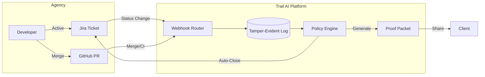

# Trail AI 🏔️

**The Delivery Assurance Platform for High-Trust Agencies.**
*Turn "code complete" into "client-ready proof" instantly.*

---

## 💼 The Business Case: Solving the "Trust Gap"

Agencies and clients suffer from a fundamental disconnect called the **Execution Gap**:
* **Clients** don't trust subjective status updates ("it's almost done") or opaque Jira tickets.
* **Agencies** lose billable hours to administrative overhead, "clarification calls," and billing disputes.

**Trail AI** is the solution: A "Metadata-First" system that acts as a neutral third-party notary for your software delivery.

### 🚀 Key Benefits

| For **Agency Owners** | For **Project Managers** | For **Clients** |
| :--- | :--- | :--- |
| **Accelerate Cash Flow**: Attach a verified Proof Packet to every invoice to eliminate "is this really done?" pushback. | **Zero Nagging**: Passive tracking means you never have to ask "did you update Jira?" again. | ** Radical Transparency**: get a tamper-evident audit trail of exactly what was delivered. |
| **Eliminate Disputes**: Hash-chained evidence provides an irrefutable timeline of intent, execution, and approval. | **Automated Closure**: The "Optimistic Closure" engine auto-finalizes tickets when criteria are met. | **Plain English Updates**: AI summarizes complex git commits into readable business value. |
| **Risk-Free Compliance**: Prove you aren't leaking IP or accessing source code with our "Metadata-Only" architecture. | **Focus on Quality**: Spend time reviewing code, not administrative checklists. | **Trust**: Know that the agency is using a verified, auditable process. |

---

## 🏗️ Architecture: "Metadata-First" (V1)
We prioritize **Security & Privacy** over "Code Auditing". Trail AI operates on a **Zero-Code-Knowledge** model:
- **We Read**: PR Titles, Branch Names, Timestamps, CI Status (Pass/Fail).
- **We DO NOT Read**: Source code files, diffs, or secrets.

This allows agencies to install Trail via **GitHub App** without granting sensitive "Contents: Read" permissions.

---

## 🔄 High-Level Workflow



---

## 🌟 Current Features (V1)

### 1. The "Passive Handshake"
* **Trigger**: Developer moves Jira ticket to "In Progress".
* **Action**: Trail creates a "Shadow Task" and starts listening for evidence.
* **Goal**: Capture intent without manual data entry.

### 2. Evidence Gathering & Hash Chain
* **Signals**: GitHub PRs, Approvals, and CI Checks are ingested via Webhooks.
* **Integrity**: Every event is hashed and linked to the previous one (`prevHash`).
* **Result**: A tamper-evident audit trail that cannot be retroactively edited.

### 3. Smart Proof Packets
* **Generation**: On task completion, Trail compiles all evidence into a `ProofPacket`.
* **AI Summary**: Uses metadata (Commit Messages + PR Description) to write a client-friendly summary.
* **Seal**: The packet is cryptographically sealed and ready for export.

### 4. Optimistic Closure
* **Logic**: "If CI passes AND Code is Reviewed, close the ticket in 24h unless Vetoed."
* **Benefit**: Automates the administrative burden of closing tickets.

### 5. The "Trust Gate" (Onboarding)
* **Mechanism**: The Dashboard is hidden by default.
* **Requirement**: Users must connect Jira + GitHub + Slack to unlock the UI.
* **Why**: Ensures every active workspace produces valid proofs from Day 1.

---

## 📂 Project Structure

```mermaid
graph TD
    root[trail/]
    apps[apps/]
    docs[docs/]
    packages[packages/]
    
    apps --> api[api/ (Hono Backend)]
    apps --> web[web/ (React Frontend)]
    
    docs --> roadmap[ROADMAP.md (Strategic Direction)]
    docs --> thesis[trail.md (The "Why" & Core Logic)]
    docs --> arch[ARCHITECTURE.md (System Design)]
    
    packages --> shared[shared/ (Schemas & Types)]
    
    api --> mod[modules/ (Feature Logic)]
    mod --> auth[auth/ (OAuth & Security)]
    mod --> events[events/ (Ingestion & Stats)]
    mod --> proofs[proofs/ (Packet Generation)]
    mod --> webhooks[webhooks/ (Signal Router)]
```

### Key Documentation Files
- **[Thesis (`docs/trail.md`)](docs/trail.md)**: The original architectural blueprint & academic background.
- **[Roadmap (`docs/ROADMAP.md`)](docs/ROADMAP.md)**: Strategic plan for V1, V1.1, and V2.
- **[Strategy (`docs/STRATEGY.md`)](docs/STRATEGY.md)**: Commercial viability and market validation.
- **[Architecture (`docs/ARCHITECTURE.md`)](docs/ARCHITECTURE.md)**: System design and security model.

---

## ⚡ Quick Start (Developer)

### Prerequisites
- Bun (`curl -fsSL https://bun.sh/install | bash`)
- Docker (for local DB) or Supabase Cloud

### Installation
```bash
# 1. Clone & Install
git clone <repo>
cd trail
bun install

# 2. Environment Setup
cp .env.example .env
# Fill in: SUPABASE_URL, GITHUB_CLIENT_ID, etc.

# 3. Run Development Server
bun dev
```

### Verification
- **Frontend**: http://localhost:5173
- **API Docs**: http://localhost:3000/doc
