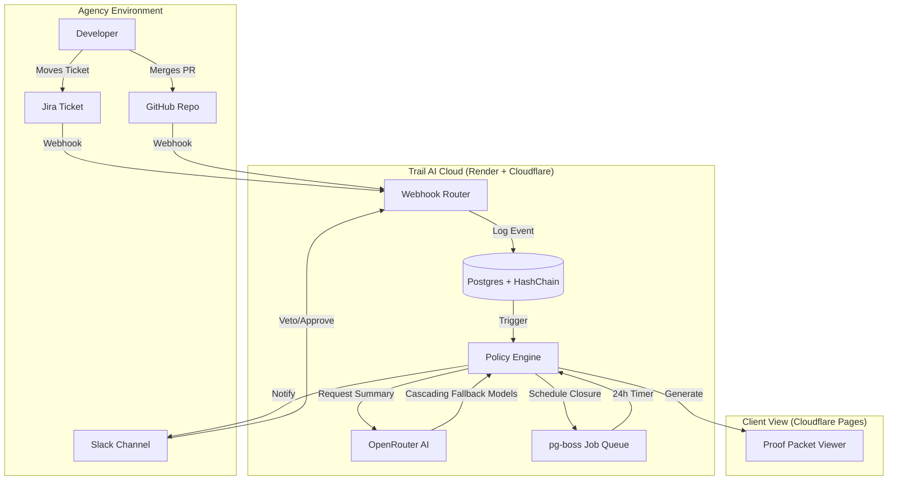

# ShipDocket Architecture 🏗️

> **System Design, Data Flow, and Security Model for ShipDocket.**

---

## 1. Core Principles
1.  **Metadata-First**: We process signals (PRs, Statuses), not source code.
2.  **Zero-Knowledge**: We cannot see, store, or leak user IP (Intellectual Property).
3.  **Tamper-Evident**: All events are hash-chained (`prevHash` -> `currHash`).
4.  **Optimistic Closure**: Assume success (CI Pass + Review), but allow human Veto.
5.  **Multi-Tenant Isolation**: Robust Row Level Security (RLS) ensures data privacy between workspaces.

---

## 2. System Diagram

---

## 3. Data Tech Stack

| Component | Technology | Role |
|-----------|------------|------|
| **Runtime** | Bun | High-performance JS runtime & package manager. |
| **API Framework** | Hono | Lightweight, Edge-ready web framework. |
| **Database** | Supabase (PostgreSQL) | Primary data store with **Row Level Security (RLS)**. |
| **ORM** | Drizzle | TypeScript-first schema definition & queries. |
| **Queue** | pg-boss | Job queue for "Optimistic Closure" timers (24h delays). |
| **AI** | **OpenRouter** | Multi-model summarization (Mistral, MiMo, GLM fallback). |
| **Frontend** | Vite + React | High-performance dashboard on **Cloudflare Pages**. |
| **API Hosting** | Render | Docker-based API and Worker via Render Blueprints. |

---

## 4. Security Model

### Authentication & Authorization
- **Supabase Auth**: Secure user authentication for the dashboard.
- **RLS (Row Level Security)**: Every database query is restricted to the user's active `workspace_id` via Postgres policies.
- **OAuth 2.0**: Encrypted token storage for GitHub, Jira, and Slack.

### Webhook Verification
- **GitHub**: `HMAC-SHA256` signature verification.
- **Slack**: `HMAC-SHA256` signing secret verification.
- **Jira**: Context verification and shared secret validation.

### Deployment (Infrastructure as Code)
- **Render Blueprints**: `render.yaml` defines the API and background worker as a unified stack.
- **Cloudflare Pages**: Global CDN hosting for the frontend with automatic deployments.

