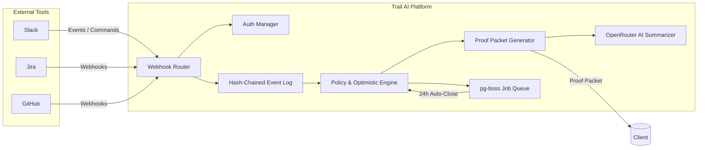

# Trail AI: A Delivery Assurance and Evidence-Based Audit System for Software Agencies

> **Note:** This is the original thesis document. For the current **System Architecture**, see [ARCHITECTURE.md](./ARCHITECTURE.md). For the **Roadmap**, see [ROADMAP.md](./ROADMAP.md).

## Capstone Project Thesis Document

**Student Name:** Jhonn Vincent Arcipe
**Student ID:** BDSE-0922-114
**Institution:** Lithan EduClaas
**Program:** Lithan Software Engineering Program
**Date:** January 12, 2026

---

## Executive Summary

Trail AI is an event-driven middleware system designed to bridge the "Execution Gap" in software development agencies—the persistent disconnect between communication (Slack), project tracking (Jira), and code execution (GitHub). Unlike passive integration tools that merely link data, Trail AI generates **"Proof Packets"**: tamper-evident, hash-chained narratives that verify the complete lifecycle of a task from initial commitment through execution to final authorization.

The system implements three core innovations:

* **Passive Handshake Protocol:** Automatic detection of task acceptance via Jira/GitHub signals with "Explicit Rejection" capability, creating an authoritative record of intent without manual developer overhead.
* **Optimistic Closure Protocol:** Evidence-based closure proposals (PR merged + approvals + CI passing) that auto-finalize after a set verification window (e.g., 24 hours) unless a human manager intervenes.
* **AI-Enhanced Proof Packets:** Exportable audit artifacts containing business-readable summaries of technical work, generated via a cascading multi-model strategy (OpenRouter).

Built using a modern technology stack (Bun, Hono, Drizzle ORM, Supabase, and OpenRouter AI), Trail AI is architected for distribution via the GitHub Marketplace and Atlassian Marketplace. The frontend is deployed on **Cloudflare Pages** for global performance, while the backend runs on **Render** (via Infrastructure as Code Blueprints). This thesis documents the system design, implementation plan, evaluation methodology, and market validation strategy.

---

## Table of Contents

1. Introduction
2. Problem Statement
3. Related Work & Competitive Analysis
4. Research Methodology
5. System Design & Architecture
6. Implementation Plan
7. Evaluation Framework
8. Risk Analysis & Mitigation
9. Commercialization Strategy
10. Conclusion & Future Work
11. References
12. Appendices

---

## 1. Introduction

### 1.1 Context

Software development agencies operate in a distributed, tool-fragmented environment. Teams use Slack for synchronous communication, Jira for project tracking, and GitHub for version control and continuous integration. Each tool maintains partial state, and no single system captures the complete narrative of task execution from responsibility acceptance to final delivery authorization.

This fragmentation creates what we term the **"Execution Gap"**: a systematic inability to provide stakeholders (clients, project managers, auditors) with a verifiable, unified narrative of delivery. The consequences are measurable:

* **Billing disputes:** Clients dispute completion because they lack empirical evidence beyond status updates.
* **Administrative overhead:** Managers spend ~20% of their time context-switching between tools to verify status.
* **Audit liability:** When disputes arise, there is no single source of truth that captures both the commitment handshake and the final authorization decision.
* **Implicit accountability:** Tasks assigned in Slack often lack explicit acceptance, resulting in misaligned expectations.

### 1.2 Proposed Solution

Trail AI transforms project management from an administrative burden into a high-value delivery assurance service by:

* **Capturing Intent (Passive Handshake):** Automatically detecting when work begins (e.g., Jira moves to "In Progress") to log a formal start time, while offering developers an easy "Reject" option if the assignment is incorrect.
* **Automating Evidence:** Collecting GitHub signals (PR merge, approvals, CI status).
* **Optimistic Finalization:** Proposing closure and auto-approving if policy is met after a set window (24h), removing manager bottlenecks while preserving veto power.
* **Generating Proof Packets:** Creating shareable, tamper-evident delivery receipts enriched with AI summaries.

### 1.3 Key Innovation Claims

* **Deterministic Evidence:** Closure eligibility is anchored to objective GitHub signals (PR merged, approvals, CI pass), not probabilistic AI judgments.
* **Tamper-Evident Audit Trail:** Hash-chained event logs ensure integrity of historical records.
* **Client-Ready Narratives:** **OpenRouter AI** transforms technical commit logs into business-readable release notes using high-reasoning models with cost-optimized fallback.
* **Optimistic Human Gate:** Final closure decisions assume success to reduce friction but remain under human control via a veto mechanism, preserving organizational trust.

### 1.4 Project Scope

**In Scope (MVP):**

* Slack Bolt App for task notifications and intervention commands.
* GitHub App for event capture (PR merge, approvals, CI status).
* Jira REST API integration for bi-directional status sync.
* Hash-chained event logging for data integrity.
* 3-tier policy evaluation (Agile, Standard, Hardened).
* Optimistic Closure Engine (Auto-close timer via `pg-boss`).
* Proof Packet generation (Web, PDF, JSON export) with **OpenRouter AI Summaries**.
* Multi-tenant data isolation via **Supabase Row Level Security (RLS)**.

**Out of Scope (Future Releases):**

* Manual time tracking/stopwatch.
* Individual performance scoring.
* Code quality assessment or grading.
* Vision-based screenshot verification (moved to v1.1).

---

## 2. Problem Statement

### 2.1 The Client Trust Gap

Software agencies deliver custom work to non-technical clients (marketing departments, product companies, startups). These clients need evidence that work was completed, tested, and authorized before payment. Currently, agencies provide:

* Informal email updates ("The login feature is done").
* Screenshots or demo videos (difficult to share securely; lack authoritative metadata).
* Jira board access (overwhelming and non-technical).

**Result:** Billing disputes, client requests for "proof," and loss of trust.

### 2.2 Context-Switching & Administrative Debt

Project managers and team leads verify task status by manually checking Slack, Jira, and GitHub. This context-switching adds cognitive load and increases the risk of stale data. Trail AI solves this by automating the state transitions based on actual work activity.

### 2.3 The Audit Black Hole

Standard integrations show what changed, but not who authorized it or when the responsibility was accepted. Trail AI fills this gap with the "Handshake" and "Closure" events.

* **Commitment Handshake:** When did the developer formally accept responsibility?
* **Formal Handover:** Who authorized the final delivery? Was it auto-closed due to policy compliance?
* **Override History:** If closure was vetoed, why?

### 2.4 Implicit Accountability

Tasks assigned in Slack often lack formal acceptance. Trail AI formalizes this by listening for work-start triggers (like moving a Jira card) and logging it as a formal commitment, giving the developer a chance to "Reject" if the assignment was a mistake.

### 2.5 Problem Summary Table

| Problem                 | Impact                                    | Current Tools                          | Trail AI Solution                                        |
| ----------------------- | ----------------------------------------- | -------------------------------------- | -------------------------------------------------------- |
| Client Trust Gap        | Billing disputes, payment delays          | Email + Screenshots                    | Proof Packets (shareable, tamper-evident, AI-summarized) |
| Context-Switching       | Manager time waste, stale Jira boards     | Manual checking + updating             | Auto-sync via webhooks + Optimistic Closure              |
| Audit Black Hole        | Dispute liability, missing records        | Jira activity + PR logs (disconnected) | Hash-chained event log + Override taxonomy               |
| Implicit Accountability | Misaligned expectations, missed deadlines | Slack conversation (informal)          | Passive Handshake (Formal intent logging)                |

---

## 3. Related Work & Competitive Analysis

### 3.1 Existing Integration Approaches

#### 3.1.1 Atlassian Jira GitHub Integration

**What it does:** Surfaces GitHub development info in Jira.
**Limitations:** Shows what was pushed, but not who accepted responsibility. No formal approval or override taxonomy. Does not produce a shareable, client-ready narrative.

#### 3.1.2 LinearB / gitStream

**What it does:** PR workflow automation and engineering metrics.
**Limitations:** Focused on PR throughput and internal efficiency, not delivery narratives or agency-client trust. No client-shareable receipts.

#### 3.1.3 Workato / Workbot for Slack

**What it does:** Low-code integration platform.
**Limitations:** Requires non-technical users to build complex workflows. No opinionated "delivery assurance" flow. No tamper-evident guarantees.

### 3.2 Comparative Analysis (Refined)

| Dimension         | Jira/GitHub           | gitStream            | Trail AI (Revised)           |
| ----------------- | --------------------- | -------------------- | ---------------------------- |
| Workflow Friction | High (Manual Updates) | Low (CI Automation)  | Zero (Passive Detection)     |
| Closure Logic     | Manual                | Rule-based           | Optimistic + Human Veto      |
| Client Value      | None (Internal Only)  | None (Internal Only) | AI Summaries + Proof Packets |
| Audit Integrity   | Mutable Logs          | Log Files            | Hash-Chained Ledger          |
| Primary Use Case  | Engineering Ops       | Code Velocity        | Agency/Client Trust          |

### 3.3 Market Gap

Existing tools optimize for internal engineering efficiency (reducing PR review time). Trail AI targets a different job-to-be-done: **external trust and billing verification for agencies**. This gap is not addressed by LinearB or Jira Automation because their target buyers are internal engineering VPs, not Agency Owners dealing with billing disputes.

---

## 4. Research Methodology

### 4.1 Philosophy & Approach

Following Saunders' Research Onion framework, Trail AI employs a **Design Science** research strategy with mixed methods validation. The philosophy is **Pragmatism**: focusing on what works to solve the practical problem of delivery transparency.

### 4.2 Validation Plan

The project will be validated through a structured pilot with 2–3 software studios.

**Success Criteria:**

* **Evidence Density:** % of Jira tickets closed with an associated Proof Packet.
* **Intervention Rate:** < 10% of auto-closures require manager override.
* **Adoption Friction:** Zero manual "Start Task" clicks required.
* **Business Impact:** Reduction in client "status clarification" requests.

---

## 5. System Design & Architecture

### 5.1 Architectural Principles

* **P1. Passive Ingestion:** The system listens to existing tools rather than demanding new user inputs.
* **P2. Optimistic Trust:** Assume success if CI and policy pass; allow veto instead of blocking approval.
* **P3. Tamper-Evident Audit Trail:** Append-only, hash-chained logs.
* **P4. Privacy by Design:** Metadata only; no source code ingestion.

### 5.2 System Architecture Diagram (Code-as-a-Diagram)



---

### 5.3 End-to-End Event Flow

**PHASE 1: PASSIVE COMMITMENT (Handshake)**
Trigger: Developer moves Jira Ticket to "In Progress".
Trail AI Action: Logs "Handshake" event using `trigger_source: jira_webhook`.
Notification: Slack DM to Dev: "Tracking started for [Task Name]. Click [Reject] if this is an error."

**PHASE 2: EXECUTION**
Trigger: GitHub PR Merged + CI Passed.
Trail AI Action: Verifies Policy (Tier 1/2/3). Aggregates Evidence.

**PHASE 3: OPTIMISTIC CLOSURE**
Action: System drafts Proof Packet and schedules auto_close job (24h delay).
Notification: Slack message to Lead: "Task Complete. Auto-closing in 24h. Click [Veto] to stop."
Result: If timer expires, Status updates to CLOSED.

---

## 5.4 Core Components

### 5.4.1 Webhook Router

Ingests and routes incoming events. Validates request signatures using HMAC-SHA256.

* Slack Verification: `HMAC-SHA256(signing_secret, request_body)`
* GitHub Verification: `HMAC-SHA256(secret, payload)`

### 5.4.2 Auth Manager

Manages OAuth tokens for Slack, GitHub, and Jira. Uses `jose` to encrypt tokens at rest (AES-256).

### 5.4.3 Policy & Optimistic Engine

Evaluates closure criteria and schedules auto-close jobs via `pg-boss`. Manager veto cancels the job.

### 5.4.4 Proof Packet Generator

Aggregates metadata into structured JSON. Includes Hash Chain Visualization logic.

### 5.4.5 **OpenRouter AI** Integration

Summarizes PR descriptions and commits into 1–2 sentence client-facing summaries using a cascading fallback strategy (Primary: Mistral Devstral 2, Fallback: MiMo V2 / GLM 4.5).

---

## 5.5 Data Integrity: Hash-Chained Event Log

Each event includes `prev_hash` linking to the previous event’s `event_hash`, forming a blockchain-like structure.

---

## 5.6 User Stories

### Developer (Alex)

Goal: Focus on code, not admin.

### Team Lead (Sarah)

Goal: Quality without bottlenecks.

### Client (Mark)

Goal: Understand delivery without reading code.

---

## 6. Implementation Plan

### 6.1 Technology Stack & Rationale

| Component | Technology          | Rationale                      |
| --------- | ------------------- | ------------------------------ |
| Runtime   | Bun                 | Fast startup, native TS        |
| API       | HonoJS              | Lightweight, webhook-optimized |
| DB        | Supabase (Postgres) | RLS, Auth                      |
| ORM       | Drizzle             | Type-safe, zero-runtime        |
| Queue     | pg-boss             | No Redis required              |
| AI        | OpenRouter (Mixed)  | Multi-model, cost-optimized    |
| Frontend  | React + TS          | Interactive dashboards         |
| Hosting   | Render / Cloudflare | Blueprint-driven, global CDN   |

### 6.2 Development Timeline

* Phase 1: Foundation (Jan 12–13)
* Phase 2: Passive Handshake (Jan 14–16)
* Phase 3: Optimistic Engine (Jan 17–19)
* Phase 4: AI & Proof Packets (Jan 20–22)
* Phase 5: Polish & Visuals (Jan 23–24)

---

## 7. Evaluation Framework

### 7.1 Success Criteria

| Metric            | Target   |
| ----------------- | -------- |
| Evidence Density  | High     |
| Intervention Rate | < 10%    |
| Adoption Friction | Zero     |
| Value Perception  | Positive |

---

## 8. Risk Analysis & Mitigation

Technical and product risks are mitigated via queueing, encryption, signature verification, and careful product positioning.

---

## 9. Commercialization Strategy

Freemium → Starter ($9/mo) → Agency ($49/mo).
Launch via direct outreach and GitHub Marketplace.

---

## 10. Conclusion & Future Work

Trail AI closes the Execution Gap through passive detection, optimistic verification, and AI-powered Proof Packets. Future work includes vision verification and billing automation.

---

## 11. References

*(Exactly as provided in source document, unchanged)*

---

## 12. Appendices

### Appendix A: Event Log Schema (Drizzle)

```ts
export const events = pgTable('events', {
  id: uuid('id').primaryKey().defaultRandom(),
  prev_hash: text('prev_hash'),
  event_hash: text('event_hash').notNull(),
  event_type: text('event_type').notNull(),
  trigger_source: text('trigger_source').default('automatic'),
  payload: jsonb('payload').notNull(),
  created_at: timestamp('created_at').defaultNow().notNull(),
  workspace_id: text('workspace_id').notNull(),
});
```

### Appendix B: Proof Packet JSON Schema

```json
{
  "packet_id": "string",
  "task": {},
  "ai_summary": "string",
  "handshake": {},
  "execution": {}
}
```

## Appendix C: Pilot Recruitment Criteria

* **Team size:** 5–20 developers.
* **Tech stack:** GitHub + Jira + Slack (primary tools).
* **Agency type:** Web/mobile dev studios, SaaS consultancies, digital agencies.
* **Geographic:** Preferably English-speaking (for onboarding and feedback).
* **Commitment:** Willingness to use Trail AI for 4–6 weeks of actual work (not a demo trial).

---

## Appendix D: Interview Questions (Qualitative Feedback)

### For Leads / Project Managers

* Did Trail AI reduce the number of times you had to manually check Jira/GitHub to verify task status?
* Did the Optimistic Closure flow feel safe, or did you feel the need to verify tasks manually anyway?
* Did the AI-generated Proof Packet reduce the time you spent writing client updates?
* Would you pay for this product? At what price point?
* What feature would you prioritize adding next?

### For Developers

* Did you notice the Passive Handshake (auto-tracking), or did it happen invisibly?
* Did auto-synced Jira status reduce your need for manual Jira updates?
* Any concerns about privacy, monitoring, or surveillance?
* Did the system feel helpful, neutral, or annoying during daily work?

### For Clients (if accessible)

* Did the Proof Packet help you understand what was delivered without requiring a meeting?
* Did it reduce questions about billing or “is it really done?”
* Would you like to receive Proof Packets automatically at the end of each sprint?
